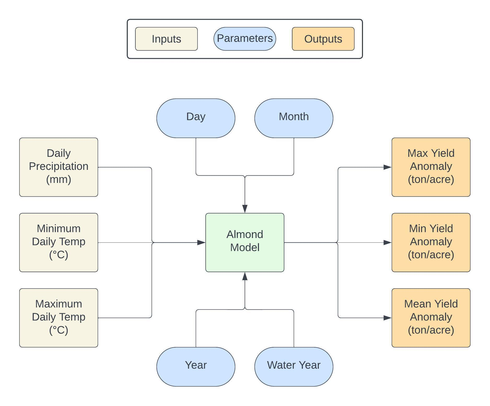
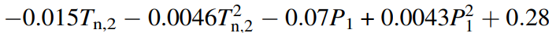

```{r setup, include=FALSE}
knitr::opts_chunk$set(echo = TRUE)
```

Goal:
Implement a simple model of almond yield anomaly response to climate
Inputs: daily times series of minimum, maximum daily temperatures and precipitation
Outputs: maximum, minimum and mean yield anomaly for a input time series


Tasks:
1. Draw diagram to represent your model - how it will translate inputs to outputs, with parameters that shape
the relationship between inputs an outputs - on your diagram list what your inputs, parameters and outputs
are with units
2. Implement your diagram as an R function

# Diagram


```{r}
# Load packages
library(tidyverse)
```


```{r}
# Read the CSV file
jan_alm <- read_csv(here::here("data/clim.txt")) %>%

  # Split the single column into multiple columns based on quotes
  separate(col = "day month year wy tmax_c tmin_c precip",
           into = c("day", "month", "year", "wy", "tmax_c", "tmin_c", "precip"),
           sep = " ") %>%

  # Convert columns to numeric
  mutate(year = as.numeric(year),
         tmin_c = as.numeric(tmin_c),
         precip = as.numeric(precip)) %>%

  # Group the data by year and month
  group_by(year, month) %>%

  # Keep only the rows where month equals 1 (January)
  filter(month == 1) %>%

  # Compute the total precipitation for each year in January
  summarise(precip_sum = sum(precip, na.rm = TRUE))

```


```{r}
# Read the CSV file 
feb_alm <- read_csv(here::here("data/clim.txt")) %>%

  # Split the single column into multiple columns based on quotes
  separate(col = "day month year wy tmax_c tmin_c precip",
           into = c("day", "month", "year", "wy", "tmax_c", "tmin_c", "precip"),
           sep = " ") %>%

  # Convert columns to numeric 
  mutate(year = as.numeric(year),
         tmin_c = as.numeric(tmin_c),
         precip = as.numeric(precip)) %>%

  # Group the data by year and month
  group_by(year, month) %>%

  # Keep only the rows where month equals 2 (February)
  filter(month == 2) %>%

  # Compute the minimum temperature for each year in February
  summarise(tempc_min = min(tmin_c, na.rm = TRUE))

```

## Model for Almond Yield

Equation:


```{r}

# Load the R script containing the almond_yield_fun function
source(here::here("almond_function.R"))

# Calculate almond yield by passing February minimum temperatures and January precipitation sums as arguments to the almond_yield_fun function
almond_yield_output <- almond_yield_fun(min_temp = feb_alm$tempc_min, precip = jan_alm$precip_sum)

almond_yield_output

```


